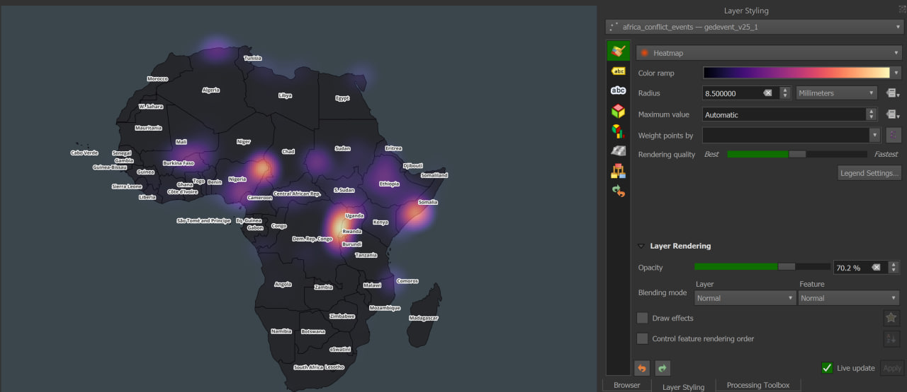
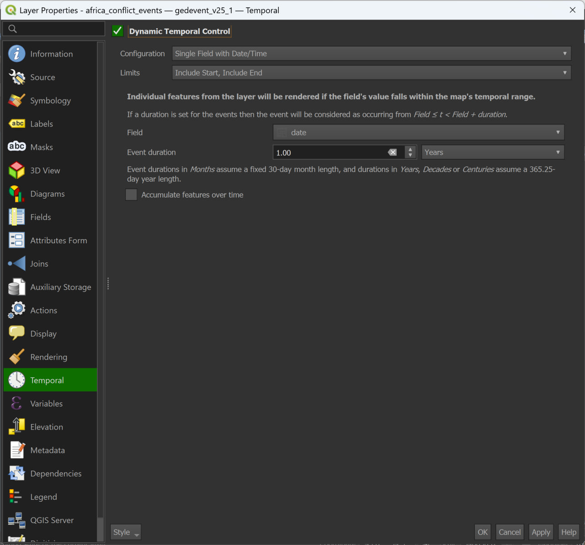

# Africa Conflict Hotspots (2000–2024)

## 🧠 Project Overview

Conflict across Africa is not evenly distributed; instead, it is concentrated in specific regions that persist or shift over time.

This project explores the spatial and temporal distribution of conflict events across Africa from 2000 to 2024 using a heatmap-based visualization approach.

By integrating geospatial analysis with temporal animation, the project highlights areas of high conflict intensity and reveals how these hotspots evolve across different regions over time.

## 🎯 Objectives

- To analyze the spatial distribution of conflict events across Africa  
- To identify regions with high concentrations of conflict activity  
- To examine how conflict hotspots evolve over time (2000–2024)  
- To visualize conflict intensity using a heatmap approach  
- To communicate spatial patterns of conflict through temporal animation

## 📊 Data Sources

- UCDP Georeferenced Event Dataset (GED) – Global Version  
  Provides disaggregated, georeferenced records of conflict events worldwide.  
  🔗 https://ucdp.uu.se/downloads/#ged_global

- Natural Earth Administrative Boundaries (50m)  
  Provides country-level boundary data used for map context and visualization.  
  🔗 https://www.naturalearthdata.com/downloads/50m-cultural-vectors/50m-admin-0-countries/

All datasets used in this project are included in the `/data` folder to ensure full reproducibility of the analysis.

## ⚙️ Methodology

### 📥 Data Acquisition

The required datasets were loaded into QGIS, including the UCDP Georeferenced Event Dataset (GED) – Global version and the Natural Earth Admin 0 Countries dataset (50m resolution), which contains global country boundaries.

The GED dataset provides disaggregated, georeferenced records of conflict events, while the Natural Earth dataset provides the necessary administrative boundaries for spatial context.

### 🧹 Data Preparation

To focus the analysis on Africa, both the country boundaries and conflict event datasets were filtered to extract only African features.

For the country boundaries, the attribute table of the Natural Earth dataset was opened and the Select Features by Expression tool was used. The expression:

"CONTINENT" = 'Africa'

was applied to select all African countries. The selected features were then exported and saved as a new GeoPackage layer representing African countries.

Similarly, the global conflict event dataset was filtered to include only events within Africa. Using the attribute table, the Select Features by Expression tool was applied with the expression:

"region" = 'Africa'

The selected conflict events were then exported and saved as a separate layer. This resulted in two working layers: an African countries boundary layer and an African conflict events layer.

### 🌍 Spatial Processing

The African conflict events layer was visualized using a heatmap approach to represent the spatial concentration of conflict events.

Before generating the heatmap, the dataset was filtered to include only events between 2000 and 2024. This was done by applying a layer filter with the expression:

"year" >= 2000

This ensured that only relevant years were included in the analysis.

The heatmap was created through the Layer Styling panel by changing the renderer type to Heatmap. A radius value of 8.5 was applied to control the spread and influence of each point, although this parameter can be adjusted depending on the desired level of detail.

A Magma color ramp was selected to effectively represent variations in conflict intensity, with brighter areas indicating higher concentrations of events.

### ⏳ Temporal Configuration

To enable temporal analysis, a date field was created from the existing year attribute in the dataset. This was necessary because the temporal controller in QGIS requires a date-formatted field.

Using the Field Calculator in the attribute table, a new field of type Date was created. The following expression was used:

make_date("year", 1, 1)

This converted each year value into a corresponding date (e.g., 2010 → 2010-01-01), allowing QGIS to interpret the data temporally.

After creating the date field, temporal properties were configured for the layer. This was done by accessing the layer properties and enabling Dynamic Temporal Control.

The configuration was set to Single Field with Date/Time, with the newly created date field selected. The temporal limits were set to include both start and end values.

An event duration of 1 year was applied, ensuring that each frame in the animation represents events occurring within a single year.

### 🎞️ Temporal Animation Setup & Visualization

After configuring the temporal properties, the animation was initialized using the QGIS Temporal Controller.

The Temporal Controller panel was activated from the main interface (clock icon), allowing access to playback and animation settings.

Before running the animation, key parameters were adjusted. The frame rate was set to 0.45 seconds per frame, controlling the speed of the animation and overall video duration. This choice ensured a smooth yet interpretable progression of yearly conflict patterns.

The animation range was automatically generated by refreshing the temporal extent, which aligned with the available date values in the dataset (2000–2024).

Once configured, the animation was played to visualize how conflict hotspots evolved across Africa over time. The temporal progression revealed shifting and persistent regions of conflict intensity across different years.

QGIS automatically determined the number of frames based on the temporal range and settings, although this can be manually adjusted if needed.

### 🗺️ Map Decoration & Animation Export

Before exporting the animation, final map decorations were applied to improve clarity and presentation.

Using the Decorations option under the View menu in QGIS, key map elements such as the title, dynamic year display, and copyright label were added. The dynamic year label was configured to update automatically as the animation progressed, ensuring clear temporal context throughout the visualization.

Additional styling adjustments were made to enhance readability, including label placement and overall layout refinement.

Once the map design was finalized, the animation was exported. This was done using the Export Animation option within the Temporal Controller.

The animation was exported as a sequence of PNG frames, covering the time period from 2000 to 2024. The output directory and spatial extent were specified during export, and QGIS generated a total of 25 frames representing yearly intervals.

### 🎬 Video Post-Processing

The exported PNG frames were compiled into a video using CapCut.

Frame sequencing, timing adjustments, and final visual enhancements were applied to produce a smooth and engaging animation. Subtle transitions and background audio were added to improve the overall presentation quality.

The final output is a temporal animation that effectively communicates the evolution of conflict hotspots across Africa.

## 🎬 Results

The final output of this project is a temporal heatmap animation showing the evolution of conflict hotspots across Africa from 2000 to 2024.

🎥 Watch the animation: https://youtu.be/88NaKtJJOFY?si=Pc5pEWAREv56y1AB

The animation highlights how conflict intensity shifts across regions over time, revealing both persistent hotspots and emerging zones of instability.

## 🔍 Key Findings

- Conflict events across Africa are spatially clustered, with intensity concentrated in specific regions rather than evenly distributed.

- The Sahel region (Mali, Burkina Faso, Niger) shows persistent hotspots, with a noticeable increase in intensity from around 2019 onward, indicating a recent escalation in instability.

- The Central African region, particularly the intersection of the Democratic Republic of Congo, Rwanda, Burundi, and Uganda, represents one of the most intense and sustained conflict zones across the entire time period.

- East Africa (Somalia region) exhibits a long-term and consistent presence of conflict, remaining active throughout most of the observed period.

- Certain regions, such as Sierra Leone and Liberia, show time-specific spikes in the early 2000s, suggesting periods of concentrated but non-persistent conflict.

- Conflict patterns are dynamic and shift within countries over time. For example, in Nigeria, conflict activity transitioned from the southern regions (pre-2010) to the north-east after 2010, with additional activity emerging in the south-south and south-east in later years.

- Overall, conflict is often localized within regions of countries, rather than affecting entire countries uniformly.

- Higher intensity areas represent greater concentration of events, not the absence of conflict in other regions.

## ⚠️ Limitations

- The heatmap represents event density, not the severity or impact of conflicts. Areas with fewer but more severe events may appear less intense.

- The dataset relies on reported conflict events, which may vary in accuracy and completeness across regions. Some areas may be underreported.

- Temporal analysis is visualized at the year level, meaning variations within a year are not individually represented in the animation.

- The use of heatmaps emphasizes regional concentration, which may obscure administrative boundaries and make country-level comparisons less precise.

- Visualization results are influenced by parameters such as radius and color ramp, which can affect how hotspots are perceived.

## 🛠️ Tools Used

- QGIS  
- CapCut 

## 👤 Author

Ohi  
